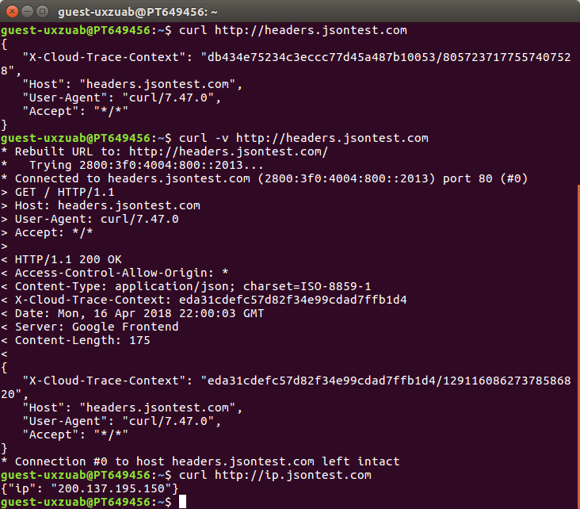

### JSON (exercícios)

1  true, false, numbers.  

2  application/json.  

3  O valor nil não é um valor literal admitido pelo JSON.

4  { "startCadence": 10, "startSpeed": 15, "startGear": 20 } 
 
5   
  a. { "cidades": ["Goiânia", "Trindade"] }  
  b. { "salada": "alface" }  
  c. { "altura": 2.3 }  
  d. { "sabor": null }  

6 
