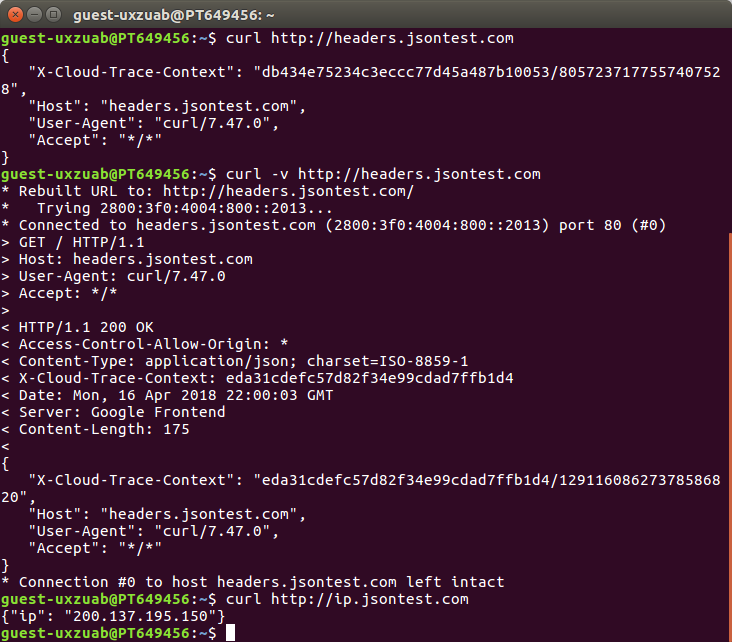

### JSON (exercícios)

1 - true, false, null, numbers.  

2 - application/json.  

3 - O valor nil não é um valor literal admitido pelo JSON e não está entre aspas.

4 - { "cadence": 10, "speed": 15, "gear": 20 } 
 
5   
  a. { "cidades": ["Goiânia", "Trindade"] }  
  b. { "salada": "alface" }  
  c. { "altura": 2.3 }  
  d. { "sabor": null }  

6 - 

7 - [Exercicio7](./src/main/java/br/ufg/inf/es/integracao/Exercicio7.java)
